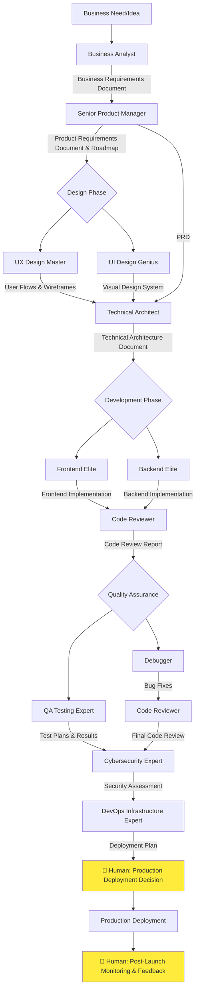

# SDLC Agent Workflow Guide

This document outlines the Software Development Life Cycle (SDLC) workflow using the specialized agents, their artifact handoffs, collaboration patterns, and human intervention points.

## 🎯 Overview

The SDLC workflow follows a structured approach where each agent produces specific artifacts that serve as inputs for subsequent agents. This ensures seamless collaboration and maintains quality throughout the development process.

## 🔄 Complete SDLC Workflow

## 📋 Phase-by-Phase Breakdown

### 1. Discovery & Analysis Phase

#### Business Analyst Agent
**Input**: Business need, stakeholder requirements
**Artifacts Created**:
- `business-requirements.md`: Comprehensive business requirements document
- `stakeholder-analysis.md`: Stakeholder mapping and influence analysis
- `acceptance-criteria.md`: SMART requirements with success criteria
- `risk-assessment.md`: Business risks and dependencies

**🤝 Human Intervention Required**:
- **Stakeholder interviews**: Facilitate meetings with key stakeholders
- **Business domain expertise**: Provide industry-specific context
- **Requirements validation**: Confirm business objectives alignment

---

### 2. Product Strategy Phase

#### Senior Product Manager Agent
**Input**: Business requirements document, stakeholder analysis
**Artifacts Created**:
- `product-requirements-document.md`: Detailed PRD with user stories
- `product-roadmap.md`: Prioritized feature roadmap with timelines
- `success-metrics.md`: KPIs and measurement framework
- `go-to-market-strategy.md`: Launch strategy and market positioning

**🤝 Human Intervention Required**:
- **Market research validation**: Confirm competitive analysis
- **Budget approval**: Validate resource allocation and timeline
- **Executive alignment**: Present strategy to leadership for approval

---

### 3. Design Phase

#### UX Design Master Agent
**Input**: Product requirements document, user personas
**Artifacts Created**:
- `user-journey-maps.md`: Complete user flow documentation
- `wireframes/`: Low-fidelity wireframes for key screens
- `interaction-patterns.md`: UX patterns and micro-interactions
- `accessibility-requirements.md`: WCAG compliance specifications

#### UI Design Genius Agent
**Input**: Wireframes, brand guidelines, user journey maps
**Artifacts Created**:
- `design-system.md`: Comprehensive visual design system
- `color-palette.json`: Color specifications and usage guidelines  
- `typography-guide.md`: Font selections and hierarchy
- `component-library/`: Visual component specifications
- `high-fidelity-mockups/`: Final visual designs

**🤝 Human Intervention Required**:
- **Design approval**: Review and approve visual designs
- **Brand alignment**: Ensure designs match brand guidelines
- **User testing**: Conduct usability testing with real users

---

### 4. Technical Architecture Phase

#### Technical Architect Agent
**Input**: PRD, wireframes, design system, non-functional requirements
**Artifacts Created**:
- `technical-architecture.md`: High-level system architecture
- `api-specifications.yaml`: OpenAPI/GraphQL schema definitions
- `database-design.md`: Data models and relationships
- `security-architecture.md`: Security controls and data flow
- `deployment-architecture.md`: Infrastructure and deployment strategy
- `implementation-phases.md`: Development breakdown and timeline

**🤝 Human Intervention Required**:
- **Architecture review**: Technical leadership approval
- **Technology stack approval**: Confirm technology choices
- **Infrastructure budget**: Validate hosting and tool costs

---

### 5. Development Phase

#### Frontend Elite Agent
**Input**: Technical architecture, design system, API specifications
**Artifacts Created**:
- `frontend-setup.md`: Project structure and configuration
- `component-implementation/`: React/Vue/Angular components
- `state-management.js`: Redux/Zustand/Context implementation
- `performance-optimizations.md`: Optimization strategies applied
- `accessibility-implementation.md`: A11y compliance verification

#### Backend Elite Agent  
**Input**: Technical architecture, API specifications, database design
**Artifacts Created**:
- `backend-setup.md`: Server configuration and structure
- `api-implementation/`: REST/GraphQL endpoint implementations
- `database-migrations/`: Schema migrations and seeders
- `authentication-system.js`: Auth/authorization implementation
- `monitoring-setup.md`: Logging and monitoring configuration

**🤝 Human Intervention Required**:
- **Development environment setup**: Configure development tools
- **Code repository management**: Set up version control workflows
- **Development milestone reviews**: Progress check-ins

---

### 6. Code Quality Phase

#### Code Reviewer Agent
**Input**: All implemented code, development artifacts
**Artifacts Created**:
- `code-review-report.md`: Comprehensive code quality assessment
- `security-findings.md`: Security vulnerabilities identified
- `performance-analysis.md`: Performance bottleneck analysis
- `refactoring-recommendations.md`: Code improvement suggestions
- `code-standards-compliance.md`: Coding standards verification

**🤝 Human Intervention Required**:
- **Code review approval**: Senior developer sign-off
- **Refactoring decisions**: Prioritize improvement recommendations

---

### 7. Quality Assurance Phase

#### Debugger Agent
**Input**: Code review findings, bug reports, error logs
**Artifacts Created**:
- `bug-analysis-report.md`: Root cause analysis of issues
- `debugging-session-logs.md`: Detailed debugging processes
- `performance-profiling.md`: Performance issue resolution
- `error-handling-improvements.md`: Enhanced error handling

#### QA Testing Expert Agent
**Input**: Technical specs, user stories, implemented features
**Artifacts Created**:
- `test-strategy.md`: Comprehensive testing approach
- `test-cases/`: Detailed test scenarios and expected outcomes
- `automation-framework/`: Test automation setup
- `performance-test-results.md`: Load and stress testing results
- `bug-reports/`: Detailed bug documentation with reproduction steps

**🤝 Human Intervention Required**:
- **Test environment setup**: Configure testing infrastructure
- **User acceptance testing**: Coordinate UAT with business users
- **Go/no-go decision**: Approve testing completion

---

### 8. Security & Compliance Phase

#### Cybersecurity Expert Agent
**Input**: Complete codebase, architecture documents, test results
**Artifacts Created**:
- `security-assessment-report.md`: Comprehensive security analysis
- `vulnerability-scan-results.md`: Automated and manual security findings
- `penetration-test-report.md`: Security testing results
- `compliance-checklist.md`: Regulatory compliance verification
- `security-hardening-guide.md`: Security configuration recommendations

**🤝 Human Intervention Required**:
- **Security review approval**: CISO or security team sign-off
- **Compliance validation**: Legal/compliance team verification
- **Penetration testing**: Third-party security testing coordination

---

### 9. Deployment & Operations Phase

#### DevOps Infrastructure Expert Agent
**Input**: Architecture docs, security requirements, performance specs
**Artifacts Created**:
- `infrastructure-as-code/`: Terraform/CloudFormation templates
- `ci-cd-pipeline.yml`: Automated deployment configuration
- `monitoring-alerting.md`: Observability setup documentation
- `disaster-recovery-plan.md`: Backup and recovery procedures
- `scaling-strategy.md`: Auto-scaling and load balancing setup
- `deployment-runbook.md`: Step-by-step deployment guide

**🤝 Human Intervention Required**:
- **Production environment approval**: Infrastructure cost and setup approval
- **Deployment authorization**: Final production deployment decision
- **Disaster recovery testing**: Validate backup and recovery procedures

---

## 🎯 Artifact Dependencies Matrix

| Creating Agent | Artifact | Consuming Agent | Usage |
|---|---|---|---|
| Business Analyst | `business-requirements.md` | Senior Product Manager | Base for PRD creation |
| Senior Product Manager | `product-requirements-document.md` | UX Design Master, Technical Architect | Design and architecture foundation |
| UX Design Master | `user-journey-maps.md`, `wireframes/` | UI Design Genius, Technical Architect | Visual design and system design |
| UI Design Genius | `design-system.md`, `component-library/` | Frontend Elite, UX Design Master | Implementation specifications |
| Technical Architect | `technical-architecture.md`, `api-specifications.yaml` | Frontend/Backend Elite | Implementation guidance |
| Frontend Elite | `component-implementation/` | Code Reviewer, QA Testing Expert | Quality assurance input |
| Backend Elite | `api-implementation/` | Code Reviewer, QA Testing Expert | Quality assurance input |
| Code Reviewer | `code-review-report.md` | Debugger, Cybersecurity Expert | Issue identification |
| QA Testing Expert | `test-results/` | Cybersecurity Expert, DevOps Expert | Quality validation |
| Cybersecurity Expert | `security-assessment-report.md` | DevOps Infrastructure Expert | Security requirements |
| DevOps Expert | `deployment-runbook.md` | Human Operations Team | Production deployment |

## 🚨 Critical Human Intervention Points

### 1. **Strategic Decision Points**
- **When**: After Business Analyst and Senior Product Manager phases
- **Required Input**: Budget approval, timeline confirmation, resource allocation
- **Decision Maker**: Executive leadership, product owner

### 2. **Design Approval Gates**
- **When**: After UX Design Master and UI Design Genius completion
- **Required Input**: Visual design approval, user testing results validation
- **Decision Maker**: Design leadership, product manager, key stakeholders

### 3. **Technical Architecture Review**
- **When**: After Technical Architect phase
- **Required Input**: Technology stack approval, scalability requirements validation
- **Decision Maker**: Technical leadership, engineering manager

### 4. **Development Milestone Reviews**
- **When**: Throughout development phases (weekly/bi-weekly)
- **Required Input**: Progress validation, scope change approval, blocker resolution
- **Decision Maker**: Engineering manager, product manager

### 5. **Quality Gates**
- **When**: After Code Reviewer and QA Testing Expert phases
- **Required Input**: Code quality approval, test coverage validation, bug triage
- **Decision Maker**: Engineering manager, QA lead

### 6. **Security & Compliance Approval**
- **When**: After Cybersecurity Expert phase
- **Required Input**: Security risk acceptance, compliance verification
- **Decision Maker**: CISO, compliance officer, legal team

### 7. **Production Deployment Authorization**
- **When**: After DevOps Infrastructure Expert phase
- **Required Input**: Final go/no-go decision, rollback plan approval
- **Decision Maker**: Engineering manager, operations team, product owner

### 8. **Post-Launch Monitoring**  
- **When**: After production deployment
- **Required Input**: Performance monitoring, user feedback analysis, issue triage
- **Decision Maker**: Operations team, product manager, engineering manager

## 📊 Success Metrics & Handoff Criteria

Each phase must meet specific criteria before proceeding:

### Quality Gates
- **Documentation Completeness**: All required artifacts present and reviewed
- **Stakeholder Approval**: Relevant stakeholders have signed off
- **Technical Validation**: Implementation meets architectural requirements
- **Security Clearance**: No critical security vulnerabilities remain
- **Performance Standards**: Meets defined performance benchmarks

### Handoff Checklist
- [ ] All artifacts delivered and reviewed
- [ ] Dependencies clearly documented
- [ ] Next phase requirements understood
- [ ] Human approvals obtained where required
- [ ] Risk mitigation strategies in place

This workflow ensures systematic progression through the SDLC while maintaining quality, security, and alignment with business objectives.